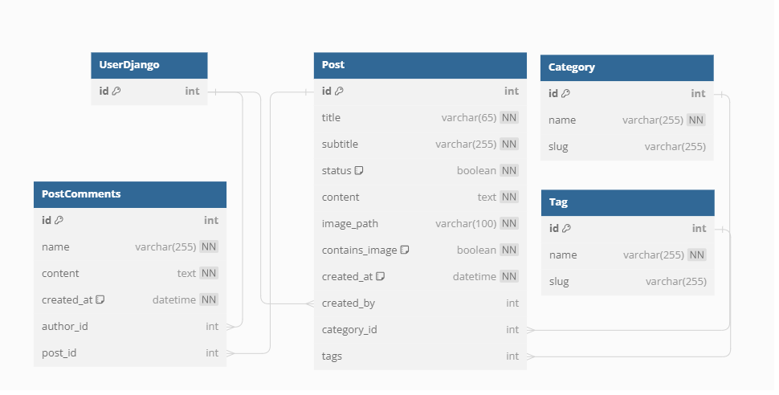

<h1 align="center">Blog MVP</h1>

## Sobre: 
    Esse projeto se trata da primeira versão de um Blog 
    Atualmente ele está na versão 0.0.1 estável, disponibilizada para clonar na main. 

## Tecnologias utilizadas: 
- Django
- Django-rest-framework
- PostgreSQL
- JWT Token
- Docker
- Git
- Git flow

## Início rápido: 
 * Você precisa ter o docker e docker compose instalado no seu computador 

    Verificando: 

    `docker-compose --version `

    `docker --version `

* Executando Build no container

    `docker-compose -f docker-compose-dev.yaml --env-file=.env.dev up -d --build`

* Executando Makemigrations

    `docker exec -ti blog_mvp_dev python blog_mvp/manage.py makemigrations api`


* Executando Migrate

    `docker exec -ti blog_mvp_dev python blog_mvp/manage.py migrate`

* Criando super user

    `docker exec -ti blog_mvp_dev python blog_mvp/manage.py createsuperuser`

* Start:

	`docker-compose -f docker-compose-dev.yaml start`

* Run:

	`docker exec -ti blog_mvp_dev python blog_mvp/manage.py runserver 0.0.0.0:8000`

    > O projeto vai estar rodando na porta 8000 no endereço `http://localhost:8000/`

* Stop:

	`docker-compose -f docker-compose-dev.yaml stop `


* Executando testes no models:

	`docker exec -ti blog_mvp_dev python blog_mvp/manage.py test api`

## Diagrama do Banco de dados:



## API Endpoints:

### Autenticação
    Depois de criar o app e o super usuário, você tem duas opções para obter o seu token JWT.

1.  Rodar no navegador
`http://localhost:8000/api/token/` 

> O DRF abre uma página em que você pode fazer login com seu usuário e senha, assim que fizer o login ele retorná na tela os seus tokens
```json
    {
    "refresh": "#########################################################################",
    "access": "##########################################################################"    
    }
```
2.  Fazer requisição ao endpoint 
`/user/login/` 

    **Descrição:** Esta rota permite o login como usuário.

    **Método:** POST

    **Parâmetros de Consulta:**
    - `username` (obrigatório): Nome de usuário.
    - `password` (obrigatório): Senha de login.
```json
    {
    "username": "########",
    "password": "########"
    }
```

### Endpoint User Logon  
 `/user/logon/`

**Descrição:** Essa rota permite o logon como usuário e retorna um token JWT. 

>Caso não tenha criado um super user na hora de executar os comandos de build, siga por essa rota.

**Método:** POST

**Parâmetros de Post:**
- `username` (obrigatório): Nome de usuário.
- `first_name` (opcional): Nome.
- `last_name` (opcional): Sobrenome.
- `email` (opcional): Email.
- `password` (obrigatório): Senha de login.


```json
{
        "username": "TesteUserLogon",
        "first_name": "Name",
        "last_name": "Name",
        "email": "root@test.com",
        "password": "testando"
}

```

**Exemplo de Solicitação:**
```http
POST /localhost:8000/user/logon/
```

**Exemplo de Retorno:**
```json
{
    "access": "##########################################################################" 
}
```


### Endpoint User  
 `/user/`

**Descrição:** Essa rota permite alterar dados de um usuário, deletar usuário ou retornar dados de todos os usuários. 

**Métodos:** GET, PUT, DELETE

**Parâmetros de Consulta:**
- `headers` (obrigatório)

        Key - Authorization 
        Value - Bearer JWT


**Exemplo de Solicitação:**
```http
GET /localhost:8000/user/ 
GET /localhost:8000/user/1/
PUT /localhost:8000/user/1/ 
DELETE /localhost:8000/user/1/ 
```

**Exemplo de Retorno:**
```json
[
    {
        "id": 1,
        "username": "TesteUserLogon",
        "first_name": "Name",
        "last_name": "Name",
        "email": "root@test.com",
        "is_active": true,
        "is_staff": false,
        "is_superuser": false,
        "date_joined": "2023-08-31T11:32:04.002513-03:00"
    }
]
```


### Endpoint Tag  
 `/tag/`

**Descrição:** Essa rota permite criar, alterar, deletar ou retornar tags. 

**Métodos:** GET, POST, PUT, DELETE

**Parâmetros de Post, Put e Delete:**
- `headers` (obrigatório)

        Key - Authorization 
        Value - Bearer JWT


**Exemplo de Solicitação:**
```http
GET /localhost:8000/tag/ 
GET /localhost:8000/tag/1/ 
POST /localhost:8000/tag/
PUT /localhost:8000/tag/1/ 
DELETE /localhost:8000/tag/1/ 
```

**Exemplo de Retorno:**
```json
[
    {
        "id": 1,
        "name": "tag",
        "slug": "tag"
    }
]
```


### Endpoint Categorias  
 `/category/`

**Descrição:** Essa rota permite criar, alterar, deletar ou retornar categorias. 

**Métodos:** GET, POST, PUT, DELETE

**Parâmetros de Post, Put e Delete:**
- `headers` (obrigatório)

        Key - Authorization 
        Value - Bearer JWT


**Exemplo de Solicitação:**
```http
GET /localhost:8000/category/ 
GET /localhost:8000/category/1/ 
POST /localhost:8000/category/
PUT /localhost:8000/category/1/ 
DELETE /localhost:8000/category/1/ 
```

**Exemplo de Retorno:**
```json
[
    {
        "id": 1,
        "name": "categoria",
        "slug": "categoria"
    }
]
```


### Endpoint Comentários  
 `/comments/`

**Descrição:** Essa rota permite criar, alterar, deletar ou retornar comentários. 

**Métodos:** GET, POST, PUT, DELETE

**Parâmetros de Post, Put e Delete:**
- `headers` (obrigatório)

        Key - Authorization 
        Value - Bearer JWT


**Exemplo de Solicitação:**
```http
GET /localhost:8000/comments/ 
GET /localhost:8000/comments/1/ 
POST /localhost:8000/comments/
PUT /localhost:8000/comments/1/ 
DELETE /localhost:8000/comments/1/ 
```

**Exemplo de Retorno:**
```json
[
    {
        "id": 1,
        "name": "comentario",
        "content": "conteudo",
        "created_at": "2023-08-31T14:27:25.663072-03:00",
        "author_id": 1,
        "post_id": 1
    }
]
```


### Endpoint Post  
 `/post/`

**Descrição:** Essa rota permite criar, alterar, deletar ou retornar postagens. 

**Métodos:** GET, POST, DELETE

**Parâmetros de Post, Put e Delete:**
- `headers` (obrigatório)

        Key - Authorization 
        Value - Bearer JWT


**Exemplo de Solicitação:**
```http
GET /localhost:8000/post/ 
GET /localhost:8000/post/1/ 
POST /localhost:8000/post/
DELETE /localhost:8000/post/1/ 
```

**Exemplo de Post:**
```json
{
   "title": "titulo", 
   "subtitle": "subtitulo",
   "status": 1,
   "content": "conteudo do post",
   "created_by": 1,
    "category": "Esportes",
    "tags": [
        {"name": "tag 1"},
        {"name": "tag 2"}
    ]
}
```

**Exemplo de Retorno:**
```json
[
    {
        "id": 1,
        "tags": [
            {
                "id": 3,
                "name": "tag 1",
                "slug": "tag-1"
            },
            {
                "id": 4,
                "name": "tag 2",
                "slug": "tag-2"
            }
        ],
        "category": "Esportes",
        "title": "titulo",
        "subtitle": "subtitulo",
        "status": true,
        "content": "conteudo do post",
        "image_path": "",
        "contains_image": false,
        "created_at": "2023-08-31T14:03:16.424614-03:00",
        "created_by": 1
    }
]
```


### Endpoint Imagem  
 `post/<int:id>/image/`

**Descrição:** Essa rota permite criar ou deletar imagens. 

**Métodos:** POST, DELETE

**Parâmetros de Post, Put e Delete:**
- `headers` (obrigatório)

        Key - Authorization 
        Value - Bearer JWT
- `form-data` (obrigatório)

        Key - image 
        Value - arquivo de imagem


**Exemplo de Solicitação:**
```http
POST /localhost:8000/post/1/image/
DELETE /localhost:8000/post/1/image/ 
```


## Considerações 

* Resiliência: 

No momento implementei rotas HTTP e retorno de status code, mas quando se trata de resiliência é importante observar a API ao longo do tempo e ajustar seus métodos.

* Performance: 

Chaves estrangeiras para otimização de consultas e integridade de dados, ultimas versões do django de pacotes e slugs para acelerar os mecanismos de buscas e garantir unicidade 

* Segurança: 

Uso de autenticação e autorização, csrf, tratamento de erros sem exibir informações comprometedoras, django orm para evitar ataques de SQL injection e restrições de acesso.

* Simultaneidade: 

Monitorar desempenho da API e escalar horizontalmente adicionando mais servidores e máquinas virtuais e realizar testes de carga para identificar possíveis gargalos. 


## Próximas Features

* Migrar views para class based views 
* Adicionar novas filtragens em rotas 
* Criar e executar testes em views 
* Tratar imagens recebidas e encontrar uma forma melhor de armazenar no sistema
* Realizar testes de carga
* Criar frontend 
